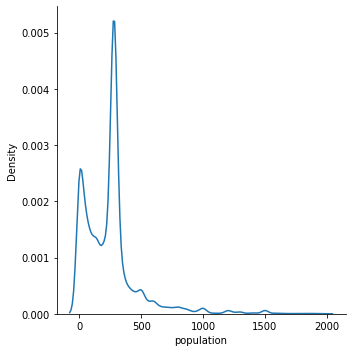

# pump-it-up 

Repository reference - https://github.com/gayaldassanayake/pump-it-up

A random forest model is used for this problem.

`n_estimators=100 `

`max_depth=100`

## Pre-process and Feature Engineering

Following feature engineering and preprocessing techniques are used in the model.

### Mathematical transformations
The feature `construction_year` was available. However the factor affecting to the condition of the pump is age more than the year. Therefore a simple transformation was used to convert year to age of pipe.

### Plotting of features

To understand the nature of categorical data, features like the set of possible categories for each feature, mode, the number of occurrences of each  category were used.

```
count      56364
unique         5
top       enough
freq       31464
Name: quantity, dtype: object
```


In order to get a proper visualization of data, for each continuous feature a kernel density estimate plots (KDE) was used to understand the nature of the distribution and the outliers. 

In the below example we can see that there is a peak at 0 due to the missing values.



### Handling missing values
For the categorical features, the mod of the training dataset was used to fill missing values.
Some of the continuous features had invalid 0s and some other definitely outliers. For them the possible max, min value was decided by reviewing Internet sources and outliers were identified. The outliers were filled with the group means of categorical features that has an impact on the continuous field.

| Feature           | Grouped by | Min (Excluding) | Max   | Description                                                  |
| ----------------- | ---------- | --------------- | ----- | ------------------------------------------------------------ |
| amount_tsh        | subvillage | 0               | 100   | The average water level is usually below 100m. There were a lot of rows with value 0 and extremely high values. They were replaced by the mean of the subvillage the pump is located. |
| longitude         | subvillage | 25              | 45    | The range of location in tanzania is roughly around 25,45. However there were several outliers. They were filled with the mean longitude as other pumps in the same village. |
| latitude          | subvillage | -15             | -1    | Can be explained similar to longitude                        |
| population        | subvillage | 0               | 20000 | There were high number of rows with value 0. These outliers were also filled with the average population of the subvillage pipes. |
| construction_year | funder     | 1400            | 2021  | The values of construction_year that are not possible in the real world world were extracted as outliers and filled with the average of the construction years of pipes built by the same funder. |


### Feature dimension reduction

Some categorical features had a large number of categories that could result in over-fitting for less frequent features. It also increased number of features after one-hot encoding which in turn makes the model overly complex.

Therefore categories to which < 1% of data points belonged to were all grouped into a new category called "other" to reduce the total number of categories.

### One-Hot encoding

In order to feed the categorical features into the model, One-Hot encoding was used.

### Feature importance calculating

Feature importance was calculated using the random forest model. It was used to identify the more important and less important features. Some of the less important features were removed. Above feature engineering tactics were tried out to increase the feature importance.

#### Example

```
quantity - 0.18
longitude - 0.12
latitude - 0.12
waterpoint_type - 0.1
subvillage - 0.07
gps_height - 0.06
construction_year - 0.06
population - 0.05
```


## Results

The highest test accuracy achieved was 0.6984. Rank - 4057.  


For the validation set the results were as follows,

|               | functional | functional needs repair | non functional |
| ------------- | ---------- | ----------------------- | -------------- |
| **recall**    | 0.72873991 | 0.5473251               | 0.67258883     |
| **precision** | 0.85010862 | 0.16583541              | 0.93200469     |

